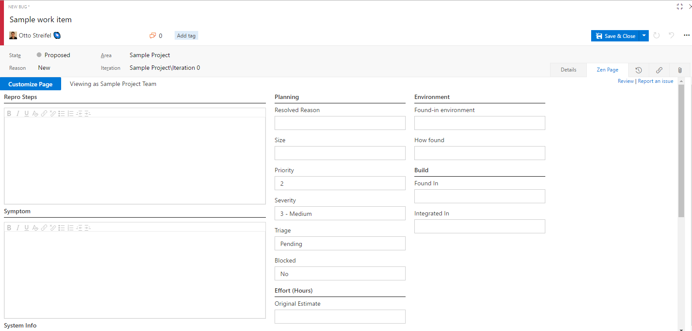
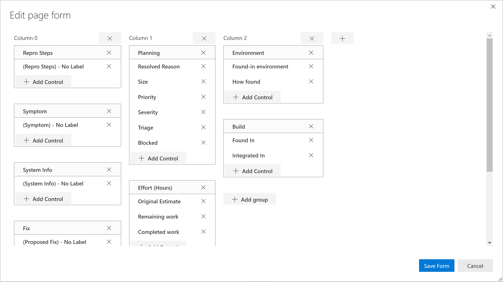

Customize a page of the work item form on a per team scope.

The form of the new page page defaults to a clone of the field controls on the first page.  

Click the "Customize Form" button to bring up the drag and drop customization experience.  
  

# Change Log
(03/01/17) v1.0.44 Identity Pickers and allowed values controls
(02/24/17) v1.0.1 Initial release